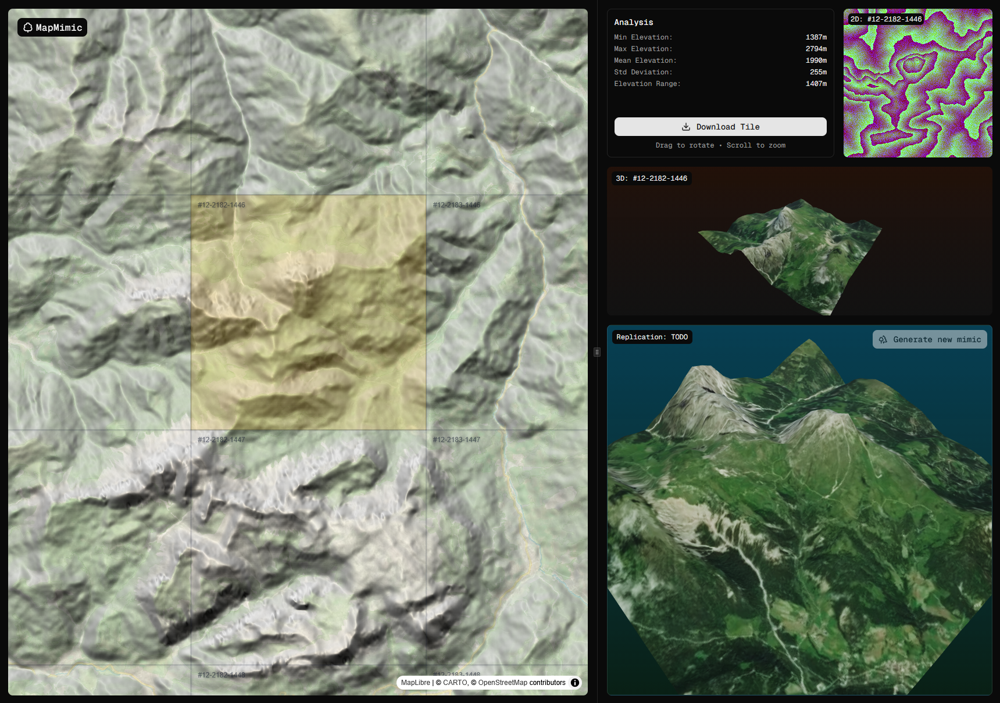

# Map Mimic

[Interactive web app](https://mapmimic-1edc9.web.app/) (work in progress) that generates procedural terrain variations using real-world DEM (Digital Elevation Model) data.

## Quick Start

```bash
# Install dependencies
npm install

# Start the development server
npm run dev

```

## Usage

1. Select a map tile to analyze.
2. View a real-time 3D terrain model.
3. Explore elevation statistics in the right panel.
4. Interact with the 3D model (drag to rotate, scroll to zoom).
5. Export tiles as needed for further use.

**_enjoy_**
